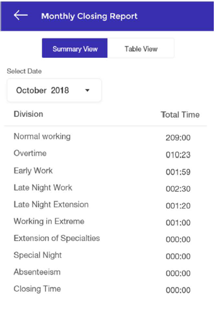
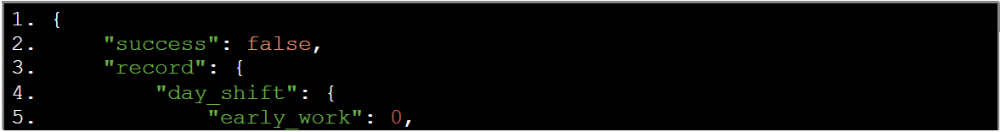
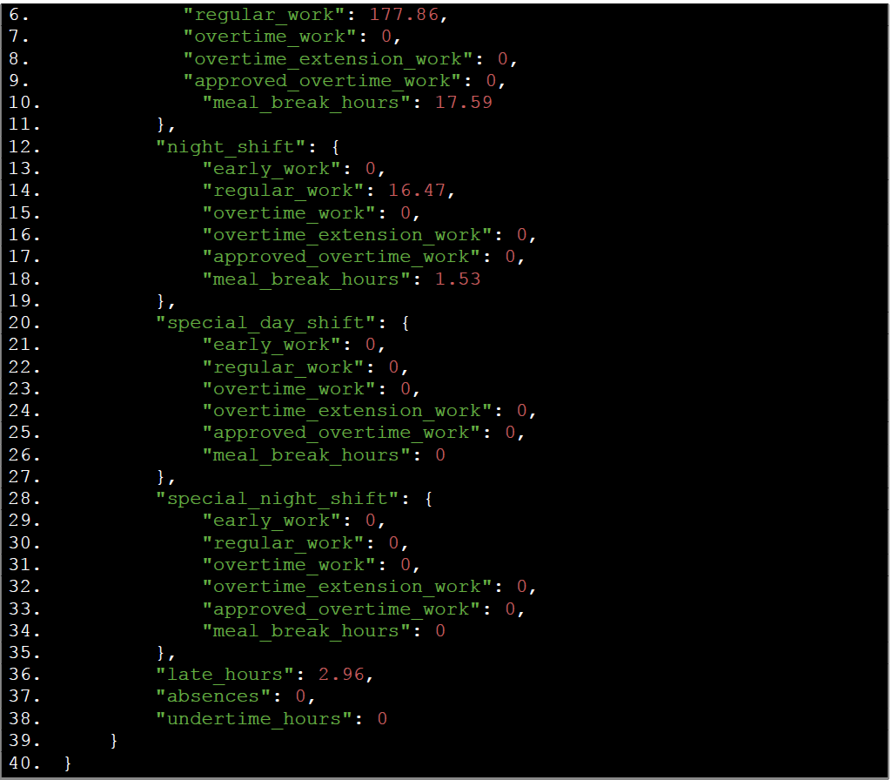
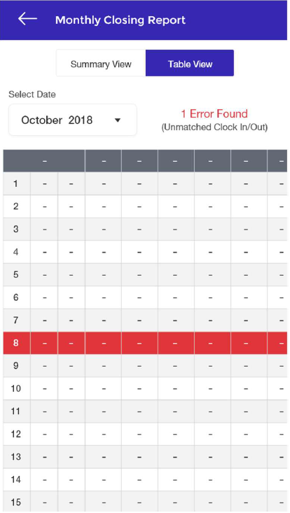
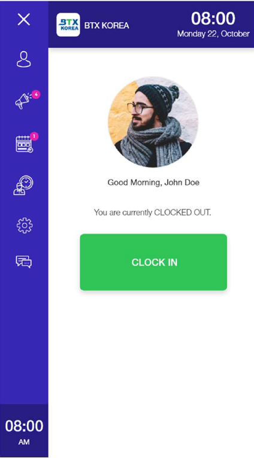
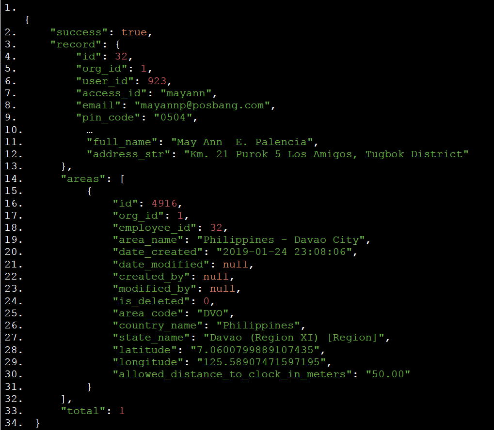

# Feature Requirements

## Monthly Closing Report

A summary report for Employees’ time clock hours. This report is generated by month depending on
user’s selection. It consists of two separate tabs:

### A. Summary View

Displays the total hours rendered of an employee within the month selected. Work hours
are grouped based on Reg Schedules, Overtime Schedules, Special Days, Lates, Undertimes,
Absences, etc

#### a. Prototype

{ loading=lazy }

#### b. API - [API Documentation Url](https://documenter.getpostman.com/view/1675910/RzthSX32)

``` 
v2/reports/my-monthly-work-report?org_id=4338&start_date=2019-01-0100:00:00&end_date=2019-01-31 23:59:59&employee_id=8464&limit=0 
```
##### Sample Responses:

{ loading=lazy }

{ loading=lazy }

#### c. Actual result and equivalent response attribute

> I. Day Shift Reg = ``` record.day_shift.regular_work ```

> II. Day Shift Early = ``` record.day_shift.early_work ```

> III. Day Shift OT = ``` record.day_shift.overtime_work ```

> IV. Day Shift Approved OT = ``` record.day_shift. approved_overtime_work ```

> V. Night Shift Reg = ``` record.night_shift_shift.regular_work ```

> VI. Night Shift Early = ``` record.night_shift.early_work ```

> VII. Night Shift OT = ``` record.night_shift.overtime_work ```

> VIII. Night Shift Approved = ``` record.night_shift.approved_overtime_work ```

> IX. Special Day Reg = ``` record.special_day_shift.regular_work ```

> X. Special Day Early = ``` record.special_day_shift.early_work ```

> XI. Special Day OT = ``` record.special_day_shift.overtime_work ```

> XII. Special Day Approved OT = ``` record.special_day_shift. approved_overtime_work ```

> XIII. Special Night Reg = ``` record.special_night_shift.regular_work ```

> XIV. Special Night Early = ``` record.special_night _shift.early_work ```

> XV. Special Night OT = ``` record.special_night _shift.overtime_work ```

> XVI. Special Night Approved OT = ```` record.special_night_shift.approved_overtime_work ```

> XVII. Late = ``` record.late_hours ```

> XVIII. Absent = ``` record.absences ```

> XIX. Undertime = ``` record.undertime_hours ```

### B. Table View

{ loading=lazy }

#### b. API - [API Documentation Url](https://documenter.getpostman.com/view/1675910/RzthSX32)

``` 
v2/reports/my-time-sheet-report?org_id=4338&start_date=2019-02-0100:00:00&end_date=2019-02-28 23:59:59&employee_id=8680&limit=0
```

#### c. Features / Functions

> I. User can select a month to base the report.

> II. The page can display all errors in the attendance or time record.

> III. Each day, if contains error, will be marked with the red background as displayed on the screenshot above (it could be the entire row as planned or just the first column).

> IV. Each cell displays the value based from the return of API call.

> V. Clicking the day row will redirect to Work Schedule (calendar view). 

> VI. If ``` enable_work_type ``` is true, hide the following columns: 4 columns of **Approved OT**.

> VII. If ``` enable_work_type ``` is false, hide the following columns: **Day Shift Early, NightShift Early, Special Day Early, Special Night  Early**.

> VIII. If no conflict/errors found, a CONFIRM ALL button will show (see prototype).

## CLOCK IN / CLOCK OUT

Allows employee to clock in, clock out or take a break. This is the default display when you open the
Sidebar menu.

### A. Prototype

{ loading=lazy }

### B. Features / Functions

#### a. GPS

> CASE A : ```check_location```  is false

>  - PROCEED TO CLOCKIN/CLOCKOUT PROCESS

> CASE B : ``` check_location ``` is true

>> I. If ```check_location``` is true, on page load, get the list of areas available for that employee.

>> II. Call API [API Documentation Url](https://documenter.getpostman.com/view/1675910/RzthSX32)
  ```
   v2/employees/employee?id=32
  ```

##### Sample Response:

{ loading=lazy }

>> III. Check if GPS is enabled in user’s device. If not, ask permission then turn on. If
turned on, start receiving location updates to get current latitude and longitude

>> IV. On click CLOCK IN / CLOCK OUT button, check again if the GPS is enabled
(because the user can still turn it off while they are on that page), then check if
the location is within the employee areas based on the latitude, longitude and
the radius set)

>> V. PROCEED TO CLOCKIN/OUT PROCESS

#### b. How to detect if CLOCK IN or CLOCK OUT button will show

> I. Call API [API Documentation Url](https://documenter.getpostman.com/view/1675910/RzthSX32)
```
v2/employees/timeclock/status?employee_id=32
```

> This will return 3 major data:

> 1. record -> current time clock record of employee

>> CASE A. If employee has current time_clock record, time clock status is CLOCKED_IN so button will show CLOCK OUT. Unless:

>>> Check company_settings ```“allowed_actual_work_hours”```. Get ```current_working_hours``` by getting the time difference of ```record.clock_in``` and current time.

>>> a. If ```current_working_hours > allowed_actual_work_hours```, time clock status is still CLOCKED_IN but the button to show is CLOCK IN.

>>> b. If ```current_working_hours < allowed_actual_work_hours```, time clock status is CLOCKED_IN and the button to show is CLOCK OUT.

>> CASE B: if employee has NO current time_clock record, time clock status is CLOCKED_OUT so button will show CLOCK IN.

> 2. prev_record -> returns the employee’s previous time_clock record to determine the LAST CLOCKED IN or CLOCKED OUT time to be displayed on the same page

> 3. break_record -> if this data is not null and company settings ```“enable_break”``` is true, display BREAK_OUT option for user (second button in this page)

#### b. API Error codes

## Test Navigation


